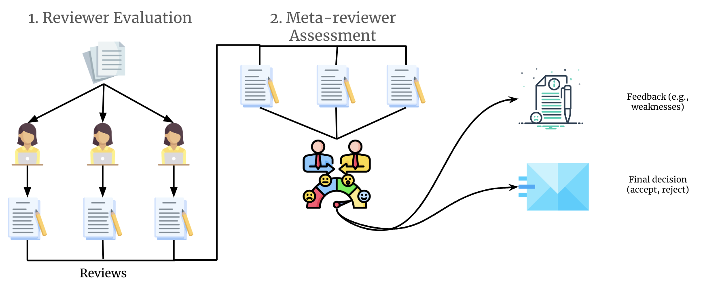

# Generative Reviewer Agents: Scalable Simulacra of Peer Review

## 📖 Description
The peer review process is fundamental to scientific progress, determining which papers meet the quality standards for publication. Yet, the rapid growth of scholarly production and increasing specialization in knowledge areas strain traditional scientific feedback mechanisms. In light of this, we introduce Generative Agent Reviewers (GAR), leveraging LLM-empowered agents to simulate faithful peer reviewers. To enable generative reviewers, we design an architecture that extends a large language model with memory capabilities and equips agents with reviewer personas derived from historical data. Our experiments demonstrate that GAR performs comparably to human reviewers in providing detailed feedback and predicting paper outcomes. Beyond mere performance comparison, we conduct insightful experiments, such as evaluating the impact of reviewer expertise and examining fairness in reviews. By offering early expert-level feedback, typically restricted to a limited group of researchers, GAR democratizes access to transparent and in-depth evaluation.

   
  <em>Figure 1: The GAR Framework Architecture.</em>

## ⚙️ Usage
To be added soon
